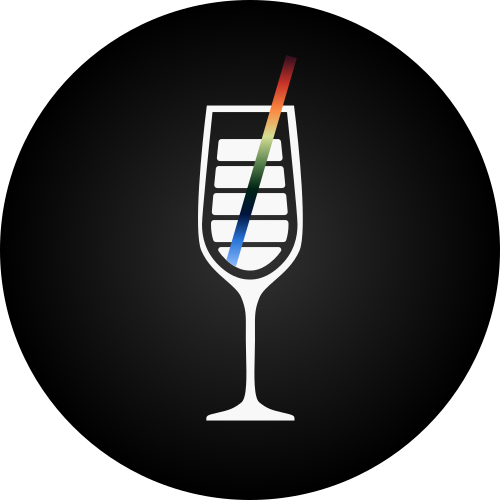

<div align="center">
  <a href="https://www.speakeasy.com/" target="_blank">
    
  </a>
  <br />
  <br />
  <a href="https://speakeasy.com/docs/create-client-sdks/" target="_blank"><b>Docs</b></a>&nbsp;&nbsp;//&nbsp;&nbsp;<a href="https://go.speakeasy.com/slack" target="_blank"><b>Join us on Slack</b></a>
  <br />
  <br />
</div>

<hr />

<p align="center">
  
  <h1 align="center"><b>tonic</b></h1>
  <p align="center">
    Forward-compatible schema fitting for API clients in TypeScript and Rust.<br />
    One model, multiple runtimes, shared parity tests.
  </p>
  <p align="center">
    <a href="https://www.npmjs.com/package/@speakeasy-api/tonic"></a>
    <a href="https://crates.io/crates/tonic_json"></a>
    <a href="https://crates.io/crates/tonic_json_derive"></a>
    <br/>
    <a href="https://www.typescriptlang.org/"></a>
    <a href="https://www.rust-lang.org/"></a>
    <a href="#workspace-commands"></a>
    <br/>
    <a href="https://speakeasy.com/"></a>
  </p>
</p>

```bash
npm i @speakeasy-api/tonic
cargo add tonic_json
```

## Packages

- [`packages/tonic`](packages/tonic): the original TypeScript package for browser and Node SDKs
- [`crates/tonic_json`](crates/tonic_json): the Rust runtime for fitting JSON into typed models with diagnostics
- [`crates/tonic_json_derive`](crates/tonic_json_derive): the proc-macro crate behind the Rust derives
- [`tooling/parity`](tooling/parity): shared TypeScript vs Rust parity cases
- [`docs`](docs): design notes and evolving Rust spec material

## Why this repo exists

API responses change over time. Fields appear, enums grow, aliases linger, and types drift. Tonic is built for that reality: instead of treating those changes as fatal, it fits incoming data into the shape your client expects and reports what had to be defaulted or coerced.

This repository hosts both runtimes so they can evolve together. The TypeScript package and Rust crates share a common behavioral model, and the parity harness keeps them aligned as the implementations grow.

## Workspace Commands

```bash
bun install
bun run build
bun run test
bun run check
bun run parity:diff
```

Rust-specific tooling is also available from the repo root:

```bash
bun run fmt:ts
bun run fmt:ts:check
bun run fmt:rust
bun run fmt:rust:check
bun run lint:rust
bun run release:all:dry-run
```

## Release Flow

Release commands are rooted at the monorepo:

```bash
bun run release:ts
bun run release:rust
bun run release:all:dry-run
```

CI keeps the Rust workspace version aligned with the TypeScript package version before publishing.
